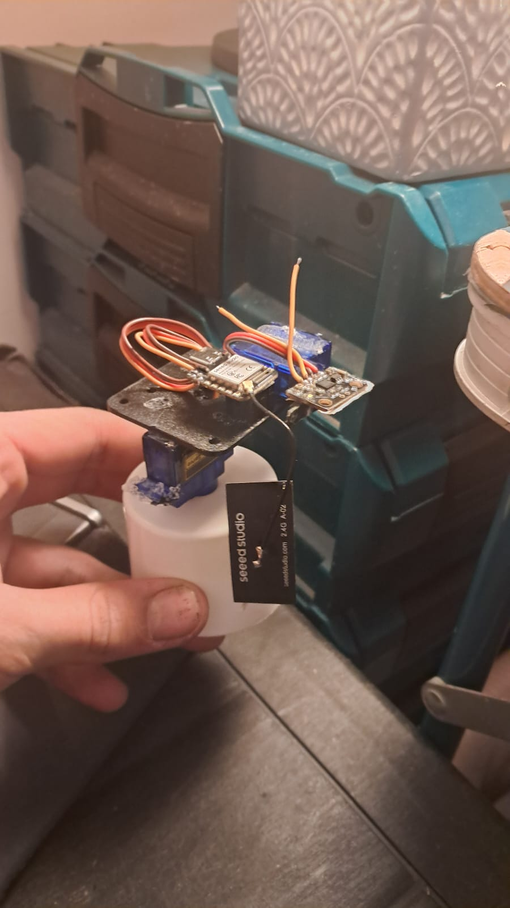
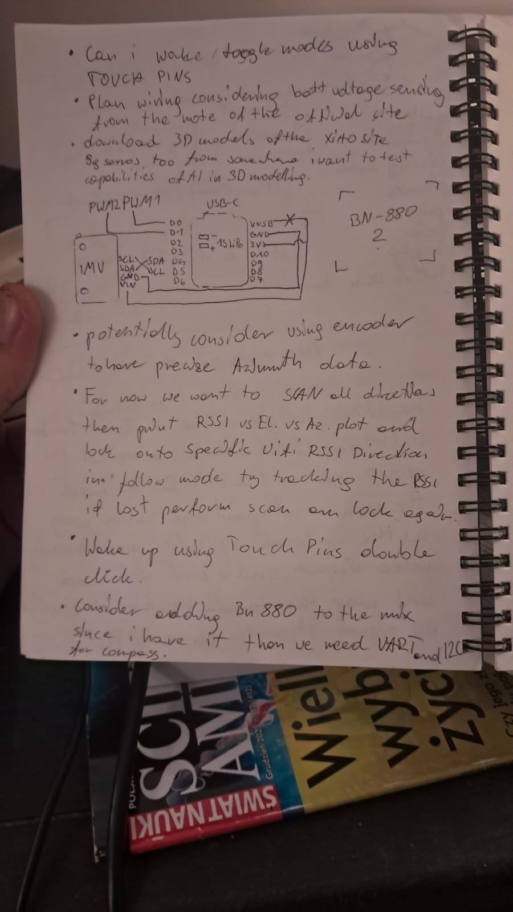
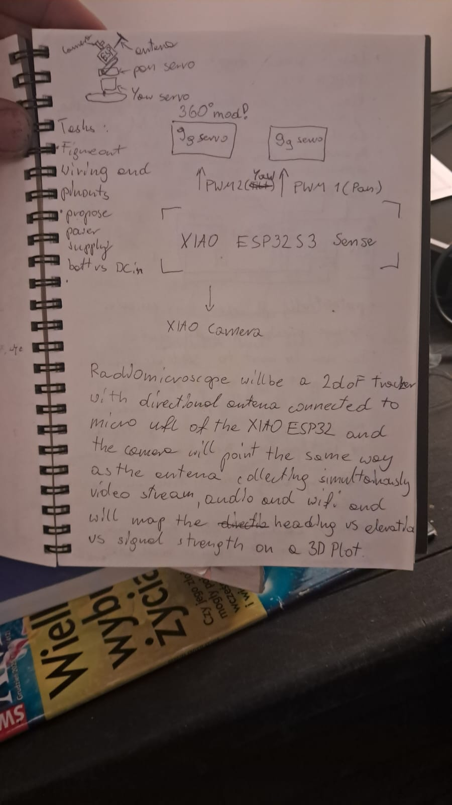

# RadioMicroscope

A 2-DOF WiFi signal tracker built on the **Seeed XIAO ESP32S3 Sense**. A directional antenna and camera mount on a pan/tilt gimbal controlled via a web interface over WiFi. The device scans for WiFi networks and maps signal strength (RSSI) against heading and elevation.

<p align="center">
  
</p>

## Hardware

| Component | Pin | Protocol |
|-----------|-----|----------|
| Servo Azimuth (SG90, 360-mod) | D0 / GPIO1 | PWM |
| Servo Elevation (SG90, standard) | D1 / GPIO2 | PWM |
| MPU-6050 IMU | SDA (D4), SCL (D5) | I2C |
| Directional Antenna | UFL connector | — |
| Power | USB-C | 5V |

### Bill of Materials
- Seeed XIAO ESP32S3 Sense
- 2x SG90 micro servo (one with 360-degree continuous rotation mod)
- MPU-6050 accelerometer/gyroscope breakout
- Directional WiFi antenna (UFL connector)
- USB-C cable for power and programming

## Features (MVP)

- **WiFi Access Point** — ESP32 creates "RadioMicroscope" network, no password
- **Web control panel** at `192.168.4.1` — dark theme, mobile-friendly
- **Azimuth control** — spring-loaded slider for continuous rotation speed/direction
- **Elevation control** — slider for 0-180 degree positioning
- **Trim calibration** — adjustable PWM center offset for azimuth servo (default 500μs)
- **Live RSSI monitor** — top 5 visible WiFi networks with signal bars
- **IMU readout** — pitch and roll from MPU-6050
- **Safety watchdog** — azimuth auto-stops if connection drops for 2 seconds

## Getting Started

### Arduino IDE

1. Add ESP32 board URL in **File > Preferences > Additional Board Manager URLs**:
   ```
   https://raw.githubusercontent.com/espressif/arduino-esp32/gh-pages/package_esp32_index.json
   ```

2. Install **esp32** board package via **Tools > Board Manager**

3. Install libraries via **Sketch > Include Library > Manage Libraries**:
   - `ESP32Servo`
   - `ESPAsyncWebServer` (by mathieucarbou/me-no-dev)
   - `AsyncTCP` (by mathieucarbou/me-no-dev)
   - `ArduinoJson`
   - `Adafruit MPU6050`
   - `Adafruit Unified Sensor`
   - `Adafruit BusIO`

   > **Note:** The standard ESPAsyncWebServer from Arduino Library Manager may not compile with ESP32 Arduino Core v3.x. Use the [mathieucarbou fork](https://github.com/mathieucarbou/ESPAsyncWebServer) instead.

4. Board settings:
   - **Board:** XIAO_ESP32S3
   - **USB CDC On Boot:** Enabled
   - **PSRAM:** OPI PSRAM

5. Open `RadioMicroscope/RadioMicroscope.ino` and upload

### arduino-cli

```bash
arduino-cli core install esp32:esp32
arduino-cli lib install ESP32Servo ArduinoJson "Adafruit MPU6050" "Adafruit Unified Sensor" "Adafruit BusIO"
arduino-cli config set library.enable_unsafe_install true
arduino-cli lib install --git-url https://github.com/mathieucarbou/ESPAsyncWebServer
arduino-cli lib install --git-url https://github.com/mathieucarbou/AsyncTCP

arduino-cli compile --fqbn esp32:esp32:XIAO_ESP32S3:USBMode=hwcdc,CDCOnBoot=cdc RadioMicroscope/
arduino-cli upload --fqbn esp32:esp32:XIAO_ESP32S3:USBMode=hwcdc,CDCOnBoot=cdc --port /dev/ttyACM0 RadioMicroscope/
```

## Usage

1. Power the board via USB-C
2. Connect your phone/laptop to WiFi network **"RadioMicroscope"**
3. Open **192.168.4.1** in a browser
4. Use the azimuth slider to rotate (hold to spin, release to stop)
5. Use the elevation slider to tilt
6. Adjust the trim value if the azimuth servo drifts when stopped (default: 500μs)
7. Watch the RSSI monitor to see WiFi signal strengths change as you rotate

## Project Structure

```
RadioMicroscope/           # Arduino IDE sketch
  RadioMicroscope.ino      # Firmware source
  web_ui.h                 # Web UI (HTML/CSS/JS as PROGMEM)
src/main.cpp               # PlatformIO firmware source (identical)
include/web_ui.h           # PlatformIO web UI header
platformio.ini             # PlatformIO build config
plan.md                    # Project plan & hardware notes
docs/                      # Photos and documentation
```

## Design Notes

<details>
<summary>Original notebook sketches</summary>




</details>

## Roadmap

- **Phase 2:** Automated scan sweep, 3D RSSI heatmap (Azimuth x Elevation x dBm)
- **Phase 3:** Lock/follow mode — track strongest signal, rescan on loss
- **Phase 4:** BN-880 GPS + compass for true heading, encoder for azimuth feedback
- **Phase 5:** Camera stream, audio capture, battery power, touch-pin wake
